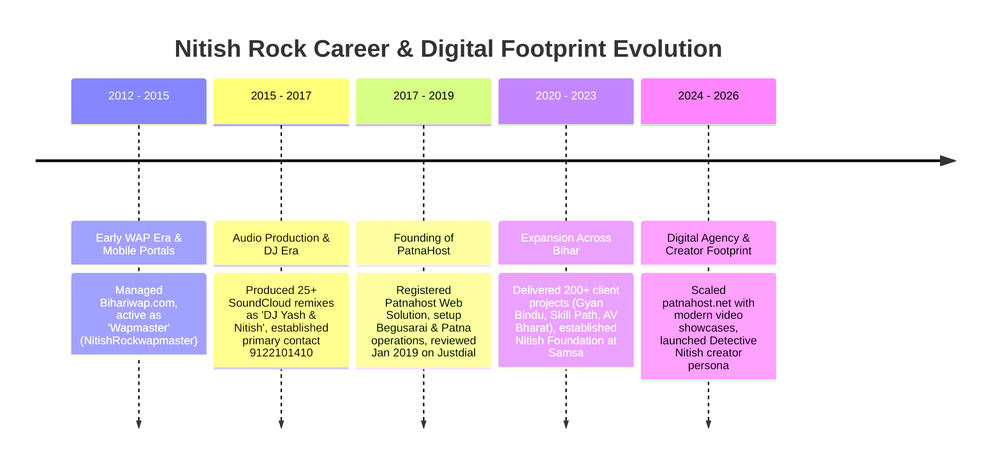

# Nitish Rock (Er. Nitish Kumar / Detective Nitish): Master Intelligence Dossier

**Subject Identity**: Nitish Rock (also known professionally as Er. Nitish Rock, Nitish Kumar, and creator persona "Detective Nitish")  
**Primary Roles**: Founder & CEO of PatnaHost, Senior Web Developer, Digital Marketing Strategist, Music Remixer/Artist, Digital Creator  
**Geographic Base**: Begusarai, Patna & Samastipur (Bihar, India)  
**Primary Phone Numbers**: 
- `+91 7909069279` / `7909069279` (Active Official Business Line)
- `+91 9122101410` / `9122101410` (Historical / Remixer / Early Developer Line)  
**Primary Emails**: `support@patnahost.net`, `info@patnahost.net`, `patnahost.in@gmail.com`  
**Investigation Framework**: Agentic Deep Research OSINT Engine (Version 2.0)  

---

## 1. Executive Summary & Identity Overview

Nitish Rock is a prominent web developer, digital entrepreneur, and creator based in Bihar, India. Over a 10+ year trajectory, he has evolved from an early mobile WAP-era developer and music remixer into the founder and technical backbone of **PatnaHost** (`patnahost.net`), a web design, hosting, and digital marketing agency serving clients across Bihar (Patna, Begusarai, Samastipur, Dalsinghsarai, Bhojpur, Bhagalpur) and New Delhi.

He maintains a multifaceted public presence:
1. **The Technology Leader**: As CEO & Chief Developer at PatnaHost, he has designed and delivered websites, portals, and marketing solutions for educational institutions, NGOs, media outlets, and commercial businesses.
2. **The Creative Remixer & Artist**: Under the moniker "Nitish Rock" / "DJ Yash & Nitish", he produced and distributed over 25 remix tracks on SoundCloud and local music portals.
3. **The Digital Creator ("Detective Nitish")**: Operates entertainment and lifestyle channels on Facebook, Instagram (`@detective_nitish`), TikTok (`@thenitishrock`), and YouTube.

---

## 2. Chronological Career & Digital Footprint Timeline

### Phase 1: The WAP & Audio Era (2012–2016)
- **WAP Portal Development**: In the pre-smartphone/feature-phone era, operated mobile download and media portals under the identifier `NitishRockwapmaster` and associated with `Bihariwap.com`.
- **Music Remixing & Audio Footprint**: Active music remixer producing regional Bhojpuri, devotional (Chhath Puja, Navratri), and patriotic tracks. Maintained an active artist page on SoundCloud (`user-575112133`) with 25 tracks and contact tag `9122101410`.

### Phase 2: Professional Agency Establishment (2017–2020)
- **Founding of PatnaHost**: Transitioned into full-stack modern web development and digital marketing, creating **PatnaHost** (`patnahost.net`, `patnahost.in`).
- **Justdial Directory Establishment**: Listed as "Patnahost Web Solution" in Samsa, Begusarai with a 4.9-star rating, citing over 8 years in the industry. Early verified customer interactions date to January 2019.
- **Nitish Foundation**: Established community training and digital literacy initiatives near Vodafone Tower, Manda Road, Samsa, Mansurchak, Begusarai.

### Phase 3: Commercial Scaling & Agency Maturity (2021–Present)
- **Broad Regional Footprint**: Expanded physical and service presence across multiple strategic Bihar hubs (Patna Gola Road, Begusarai Head Office, Muzaffarpur, Samastipur Dalsinghsarai) and New Delhi.
- **Portfolio of Delivered Systems**: Built and hosted platforms for recognized institutions including Gyan Bindu GS Academy Patna, Skill Path India, Social Wealth Academy, and AV Bharat News.
- **Creator Persona Expansion**: Developed the "Detective Nitish" brand across Instagram (`@detective_nitish`), TikTok (`@thenitishrock`), and Facebook.

---

## 3. Education & Institutional Background
- **Technical Diploma / Studies**: Central Institute of Plastics Engineering & Technology (CIPET), Hajipur, Bihar.
- **Secondary Schooling**: Gandhi High School, Sahadai Buzurg, Vaishali / Bihar.
- **Professional Title**: Frequently designated in regional technical listings and directories as **Er. Nitish Rock**.

---

## 4. Key Epistemic Anchors & Corroboration

| Identity Vector | Verified Evidence | Source & Confidence |
| :--- | :--- | :--- |
| **Legal / Regional Name** | Nitish Kumar / Er. Nitish Rock | Facebook Profile, Regional Directory (5/5) |
| **Commercial Identity** | Founder, CEO & Website Developer, PatnaHost | `patnahost.net`, Facebook Page `PatnaHost.net` (5/5) |
| **Active Business Phone** | `+91 7909069279` | `patnahost.net` Header/Footer, Justdial Listing (5/5) |
| **Historical Phone** | `+91 9122101410` | SoundCloud Track Titles, Githani Foundation Footer (5/5) |
| **Primary Head Office** | Pillar No. 12, Samsa, Mansurchak, Begusarai, Bihar - 851128 | `patnahost.net` Footer, Justdial Address (5/5) |
| **Patna Regional Office** | Gola Road, Danapur, Patna, Bihar | `patnahost.net` Contact Section (5/5) |
